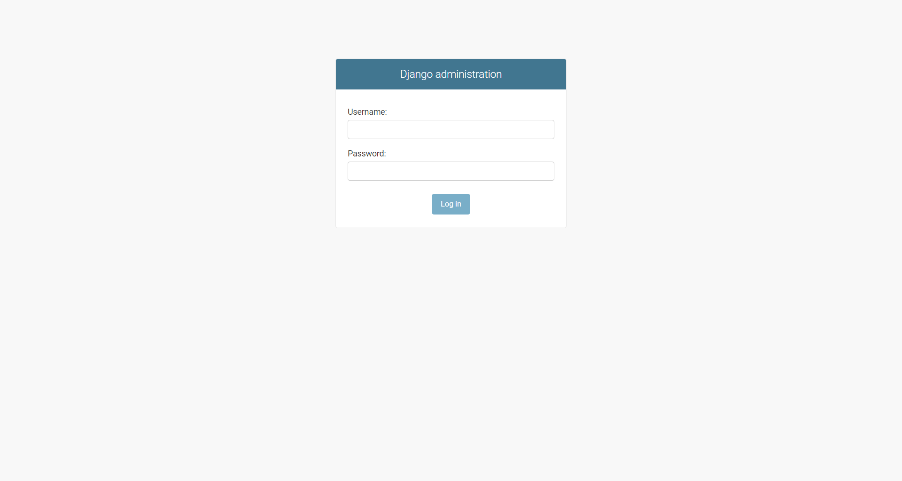
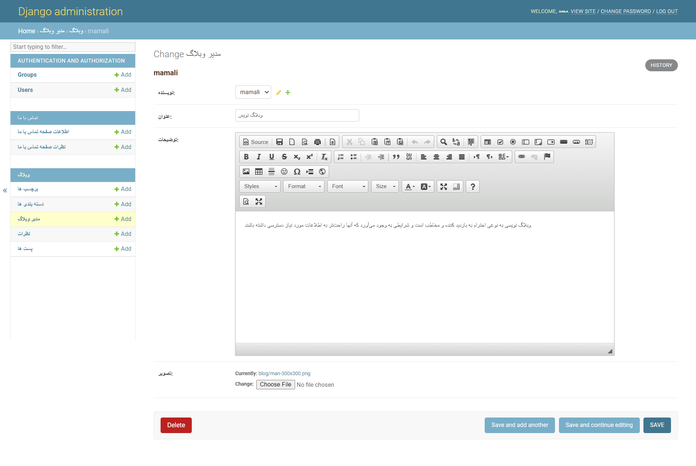
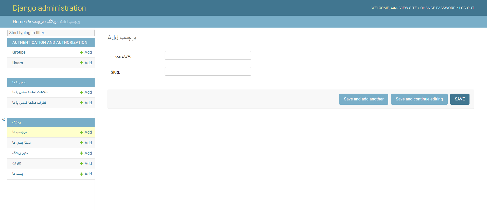
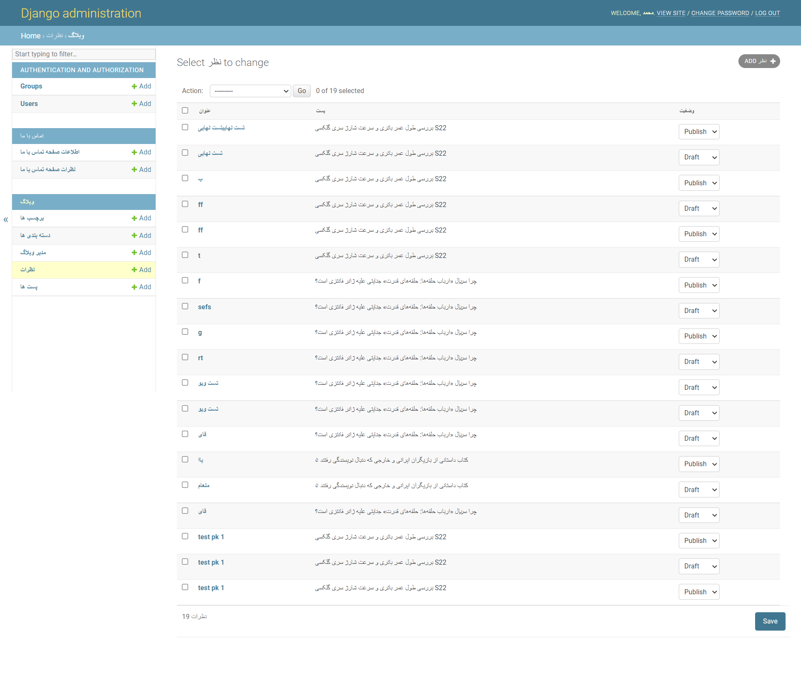
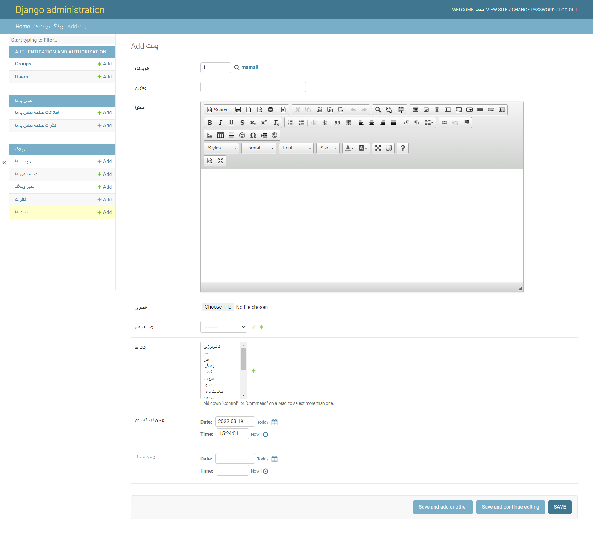
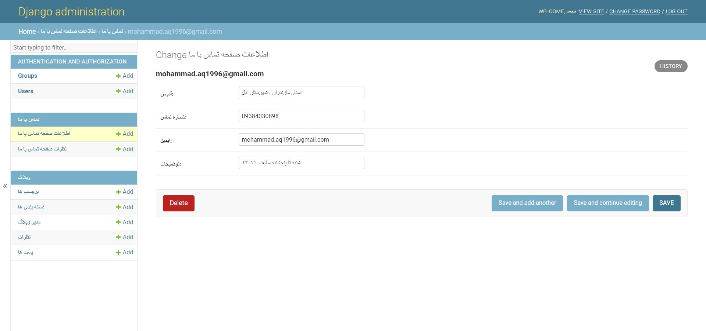
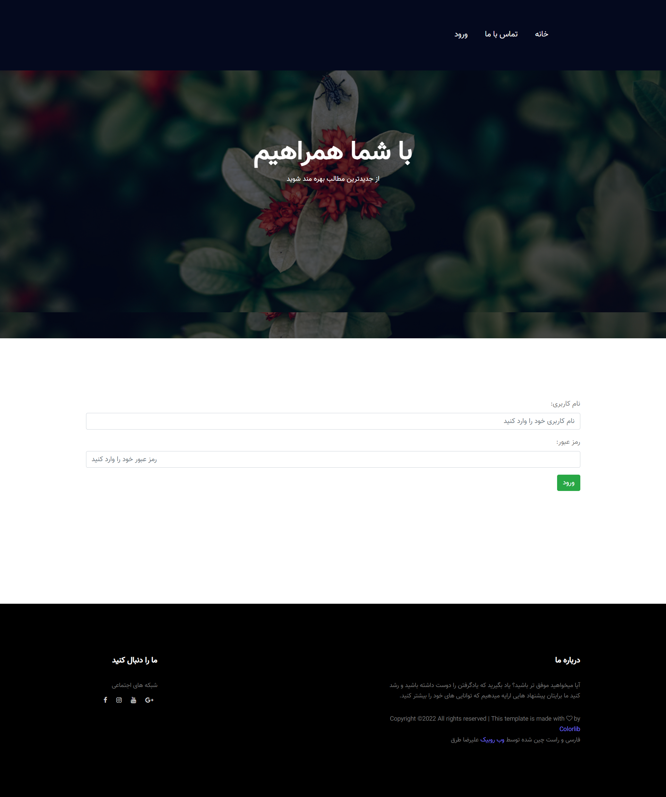
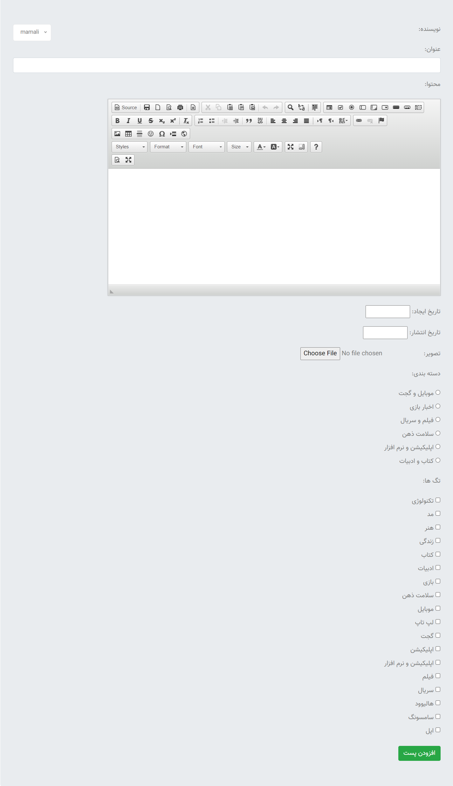
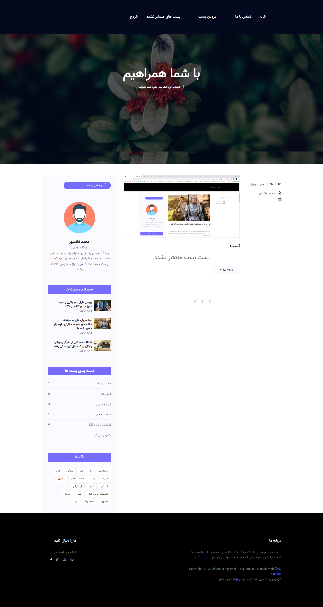
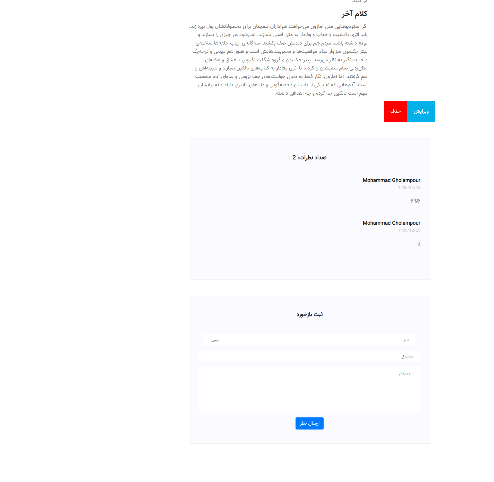

<h1 align="center">پروژه وبلاگ شخصی داکرایز شده</h1>
پروژه وبلاگ شخصی میباشد که مدیر وبلاگ توانایی انتشار، ویراش و حذف پست های وبلاگ را دارا میباشد.  
مدیر میتواند پست های پیش نویس بسازد و همچنین زمان انتشار پست ها را تعیین نماید تا در زمان مقرر پست مربوطه در سایت منتشر شود 
مدیر سایت علاوه بر منوی مدیریت جنگو از طریق خود وبلاگ نیز میتواند پست ها را مدیریت کرده و اقدام به افزودن پست جدید نماید  

این پروژه را به عنوان نمونه کار توسط **فریمورک جنگو** پیاده سازی شده است. پایگاه داده پروژه به کمک **داکر** به postgresql متصل شده است. همچنین در پروژه از
**django rest API**
, سیستم احراز هویت
**JWT**
استفاده شده است. جهت دانلود رایگان قالب میتوانید از لینک زیر استفاده کنید :  

<a href='https://webrubik.com/product/preview/meetme-bootstrap4-free-template'>
دانلود رایگان قالب استفاده شده در پروژه 
 </a>

 وبلاگ در هاست رایگان سایت pythonanywhere پیاده سازی شده است. برای مشاده آنلاین وبلاگ میتوانید به لینک مقابل مراجعه کنی: <a href='https://mohammadaq1996.pythonanywhere.com/'>پروژه وبلاگ </a>
  

امکانات پروژه به شرح ذیل میباشد:

<ul dir="rtl">
    <li>استفاده از پایگاه داده postgresql</li>
    <li>تعیین زمان برای انتشار پست ها</li>
    <li>جستجو میان پست ها</li>
    <li>استفاده از برچسب ها</li>
    <li>دسته بندی پست ها</li>
    <li>استفاده از تقویم شمسی هجری</li>
    <li>استفاده از ویرایشگر متن CK editor</li>
    <li>ارسال نظر بازدیدکنندگان زیر همه ی پست ها</li>
    <li>انتشار نظر بازدیدکنندگان با تایید مدیر</li>
</ul>

&nbsp;

&nbsp;

<h2 align="center">برای مدیریت قسمت های مختلف وبلاگ برای مدیر وبلاگ دو انتخاب وجود دارد:</h2>

<b>الف) انتخاب اول و اصلی از طریق پنل مدیریت سایت قابل دسترسی میباشد. مدیر وبلاگ با وارد کردن نام کاربری و رمز عبور خود وارد پنل مدیریت شده و امکان مدیریت بخش های مختلف وبلاگ را خواهد داشت. امکاناتی که برای مدیر وبلاگ فراهم شده است به شرح زیر می باشد :</b>

  

<ul dir="rtl">
<li>
 قسمت مالک وبلاگ: در قسمت اول از بین نویسندگان سایت مالک یا همان مدیر وبلاگ را انتخاب کنید. چنانچه هیچ نویسنده ای به وبلاگ اضافه نکرده باشید، به طور خودکار مدیر توسط سیستم انتخاب می شود. در بخش دوم عنوانی که می خواهید در قسمت درباره مالک وبلاگ نمایش داده شود را وارد کنید. در قسمت سوم توضیحات مربوط به مالک این وبلاگ را وارد نمایید و در نهایت در قسمت چهارم یک تصویر از مالک وبلاگ را آپلود کنید.
</li>
  

<li>

   قسمت برچسب ها: دراین قسمت مدیر وبلاگ می تواند برچسب های دلخواه خود را اضافه، ویرایش و حذف نماید. لازم به ذکر است که هر پست میتواند به تعداد دلخواه برچسب داشته باشد جهت افزودن برچسب فقط کافیست عنوان برچسب را وارد کنید. همچنین slug به صورت اتوماتیک با توجه به عنوانی که وارد کرده اید ساخته خواهد شد همچنین شما می توانید آن را ویرایش کنید.

</li>
  

<li>

       قسمت دسته بندی ها: دراین قسمت مدیر وبلاگ می تواند دسته بندی های مورد نیاز وبلاگ را اضافه، ویرایش و حذف نماید. لازم به ذکر است که هر پست میتواند فقط و فقط یک دسته بندی داشته باشد. همچنین slug به صورت اتوماتیک با توجه به عنوانی که وارد کرده اید ساخته خواهد شد. همچنین شما می توانید آن را ویرایش کنید.

</li>
  

<li>

    قسمت نظرات: در پایین همه پست های وبلاگ امکان ارسال نظر برای همه بازدیدکنندگان فراهم می باشد. همه این نظرات در قسمت نظرات پنل مدیریت ذخیره می شوند. و با اجازه ادمین وبلاگ منتشر میشوند. جهت تایید هر نظر برای انتشار هر مقاله فقط کافیست مدیر وضعیت نظر مربوطه را از حالت منتشر نشده به منتشر شده تغییر دهد و سپس از روی ذخیره کلیک کند.

</li>
  

<li>
قسمت مدیریت پست ها: در این قسمت مدیر وبلاگ پست های وبلاگ را مدیریت(افزودن، ویرایش و حذف) میکند. برای افزودن یک پست در بخش اول نویسنده پست، در بخش دوم عنوان پست و در بخش سوم محتوای پست را مشخص میکنیم. در بخش چهارم تصویر مرتبط به پست را آپلود میکنیم. در بخش پنجم دسته بندی پست را مشخص میکنیم. در بخش برچسب ها؛ برچسب های مرتبط با پست مورد نظر را انتخاب می کنیم.  در بخش بعدی زمان نوشته شدن پست به صورت خودکار توسط سیستم مشخص می شود. اما شما می توانید آن را تغییر دهید.(توصیه میشود که در مقدار پیش فرض تغییری ایجا نکنید). و در آخر  مهم ترین بخش این قسسمت تعیین زمان انتشار پست میباشد. این قسمت تنها بخشی از قسمت مدیریت پست ها میباشد که مدیر وبلاگ میتواند آن را خالی بگذارد. در صورتی که مدیر تاریخ انتشار را خالی بگذارد پست منتشر نمیشود. همچنین اگر مدیر وبلاگ در این بخش تاریخی را انتخاب کند که هنوز فرا نرسیده است پست تا آن زمان منتشر نخواهد شد.

</li>
  
قسمت اطلاعات صفحه تماس با ما: مدیر وبلاگ می تواند آدرس، شماره تلفن، ایمیل و توضیحات دلخواه خود را جهت نمایش در صفخه تماس با ما وبلاگ در این بخش وارد کند.

</li>
  

<li>

قسمت نظرات صفحه تماس با ما: نظرات بازدیدکنندگان وبلاگ در مورد وبلاگ در این بخش ذخیره میشوند.

</li>

<li>

    در قسمت کاربران مدیر وبلاگ می تواند مشخصات خود را ویرایش کرده و برای وبلاگ خود نویسنده یا مدیر مشخص کند و سطح دسترسی های آنها را مدیریت کند.

</li>
</ul>

<b>
    ب) راه دوم که برای مدیریت پست ارائه شده از طریق فرم هایی است که  مدیر سایت از طریق گزینه لاگین موجود در منوی وبلاگ به آنها دسترسی دارد. لازم بذکر است که از طریق صفحه اصلی سایت امکان ثبت نام برای کاربران وجود ندارد. فقط و فقط مدیر یا نویسندگانی که از طریق پنل مدیریت سایت قبلا توسط مدیر وبلاگ اضافه شده اند می تواند لاگین کنند. پس از لاگین کردن مدیر یا نویسندگان به سایت، دو گزینه جدید در منوی سایت پدید می آید: 

</b>
  

<ul dir="rtl">
<li>

 افزودن پست: این قسمت ساز و کار مشابهی با افزودن پست در پنل ادمین دارد. 

</li>
  

<li>

    پست های منتشر نشده: همان پست هایی هستند که تاریخ انتشار آنها مشخص نشده یا تاریخ مشخص شده هنوز فرا نرسیده است.

</li>
  

</ul>

    یک امکان مهم دیگر که مدیر وبلاگ با لاگین کردن به دست می آورد این است که در انتهای هر پست دو گزینه جدید ویرایش و حذف اضافه شده که امکان مدیریت هر پست را به صورت اختصاصی در صفحه همان پست ارائه می دهد

  
